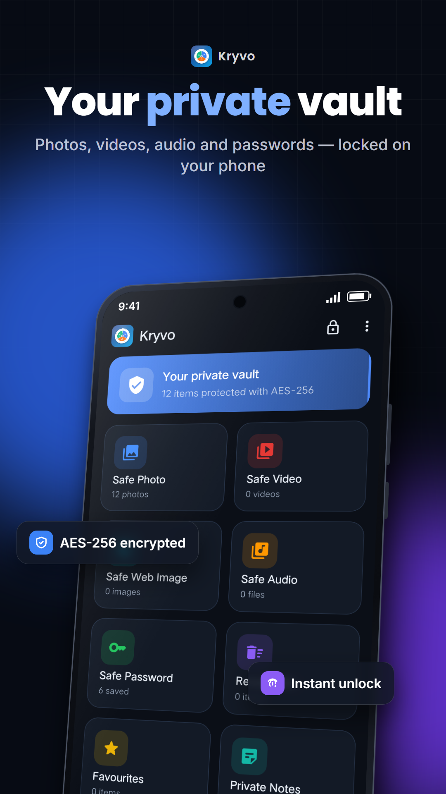
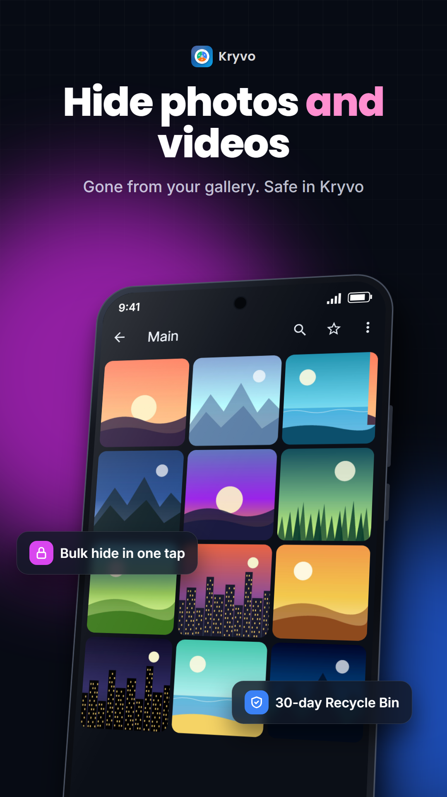
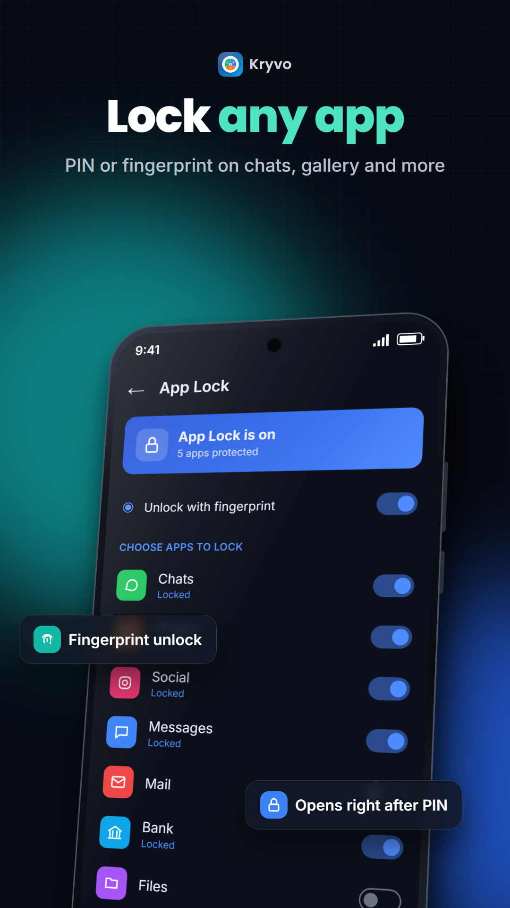
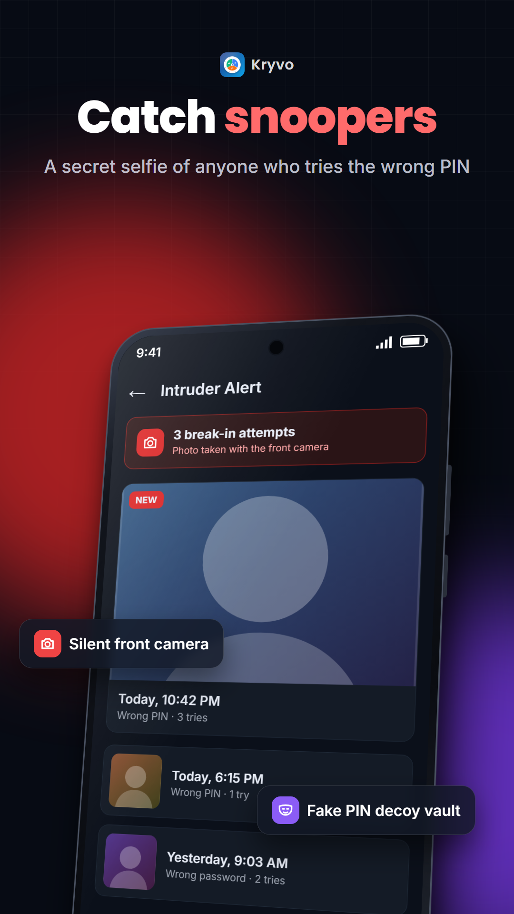

<p align="center"></p>

<h1 align="center">Kryvo — Private Vault for Android</h1>

<p align="center">
An <b>offline, encrypted vault</b> for photos, videos, audio, passwords and notes —
that can <b>disguise itself</b> as a calculator, clock, notes app, game or flashlight.
</p>

<p align="center">
<b>🌐 Website & live demo:</b> <a href="https://usmanfarazz.github.io/kryvo/">usmanfarazz.github.io/kryvo</a> ·
<b>🔒 Privacy policy:</b> <a href="https://usmanfarazz.github.io/kryvo/privacy.html">privacy.html</a>
</p>

<p align="center">




</p>

<p align="center">


</p>

---

## ✨ Try it

The [live demo](https://usmanfarazz.github.io/kryvo/) is a clickable simulation of the app in your
browser: enter PIN `1234` for the real vault or `0000` for the decoy vault.

> 📱 Kryvo is an Android app and is coming soon to Google Play.

## Why it's safe

- **No internet permission** — Kryvo physically cannot send your data anywhere. No account, no
  cloud, no ads, no analytics.
- **Strong encryption** — files are encrypted with **AES-256-GCM** (large videos in 1 MiB chunks).
  Passwords and notes are encrypted with a key derived from your master password using
  **PBKDF2-HMAC-SHA256 (310,000 rounds)**. The master password is never stored.
- **Keys in the Android Keystore** — the media key and quick-unlock data live in Keystore-backed
  storage.
- **Screenshot protection** — the vault can't be screenshotted and is blurred in recent apps.

> ⚠️ If you forget your master password and have no recovery key, the data cannot be recovered —
> that is the point of end-to-end encryption. Set up a **Recovery key** in Settings.

## Features

| | |
|---|---|
| 📷 **Hide photos, videos, web images & audio** | Removes the originals from the gallery. Folders, ⭐ favourites, search & sort, slideshow, video resume. |
| 🧮 **Disguise icons** | A *working* Calculator, Clock, Notes, Game or Flashlight on the home screen; only your secret code opens the vault. |
| 🛡️ **App Lock** | PIN or fingerprint on WhatsApp, Gallery or any app. |
| 📸 **Intruder selfie** | Front-camera photo of anyone who enters a wrong PIN, plus a break-in log. |
| 🎭 **Fake PIN** | Opens a separate, nearly empty decoy vault if you are forced to unlock. |
| 🔑 **Passwords & private notes** | Password generator and a health check for weak, reused and old passwords. |
| 🔒 **Folder lock** | An extra PIN on single folders. |
| 💾 **Full encrypted backup** | One `.kryvo` file with everything → Google Drive or phone; merge-restore on a new phone. |
| ♻️ **Recycle Bin + recovery** | "Delete permanently" stays recoverable for 30 days; scan for lost files. |
| 📤 **Share → Kryvo** | Hide photos straight from other apps (hidden while a disguise is active). |
| 📳 **Shake / face-down to lock** | Lock instantly. |
| 🎨 **15 themes · 18 languages** | Incl. Urdu & Arabic (right-to-left). |
| 👆 **Fingerprint / face unlock, PIN or password** | Plus auto-lock, recovery key and a security question for the PIN. |

## Tech

- **Flutter / Dart** UI and logic, with native **Kotlin** for launcher-icon switching, App Lock
  (foreground service + usage access), torch, MediaStore and the system file picker.
- Encryption via [`cryptography`](https://pub.dev/packages/cryptography) +
  [`cryptography_flutter`](https://pub.dev/packages/cryptography_flutter) (hardware-accelerated
  AES-GCM / PBKDF2 on Android).
- Storage via [`flutter_secure_storage`](https://pub.dev/packages/flutter_secure_storage)
  (Android Keystore) and app-private files.
- Fully free: every icon and feature is unlocked, no in-app purchases, no ads.

```
lib/
  disguise/   working Calculator, Notes, Clock, Game and Flashlight disguises
  screens/    all app screens
  services/   crypto, media vault, backup, app lock, intruder, purchases…
  state/      AppState (single ChangeNotifier)
  l10n/       translations (18 languages)
android/      Kotlin: icon aliases, App Lock service & lock screen, share target
docs/         website, live demo and privacy policy (GitHub Pages)
store/        Google Play listing texts and form answers
```

## Build

```bash
flutter pub get
flutter test
flutter run                      # installs "Kryvo Dev" (debug, separate app id .dev)
flutter build appbundle          # release App Bundle for Google Play
```

Release bundles are signed with an upload key read from `android/key.properties`, which is **not**
in this repository (see `.gitignore`).

## Security notes / roadmap

- PBKDF2 is used for broad hardware support; Argon2id would be stronger and is a possible upgrade.
- iOS is not supported yet (App Lock in particular isn't possible on iOS).
- Found a security issue? Please see [SECURITY.md](SECURITY.md).

## Contact

Made by **Usman Faraz** · Faraz Labs —
[Email](mailto:usmanfaraz1818@gmail.com) · [LinkedIn](https://www.linkedin.com/in/usman-farazz)

© 2026 Usman Faraz. All rights reserved.
